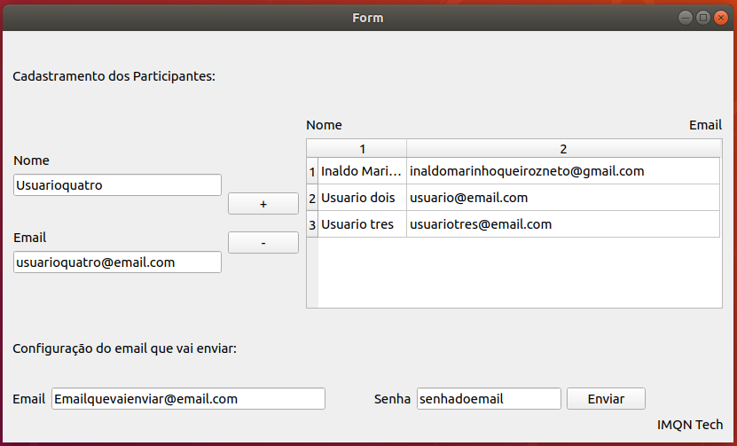

# Sorteador

Foi um programa desenvolvido para sortear um amigo secreto e enviar via email quem é o amigo secreto de cada pessoa. 

Atualmente possui uma versão 2.0 que foi produzida utilizando o PYQT. 

Obs: O email que irá enviar o amigo secreto precisa ter autorização para aplicativos menos seguros. Voce pode fazer isso utilizando esse .

Abaixo uma imagem da versão 2.0 do sorteador:

